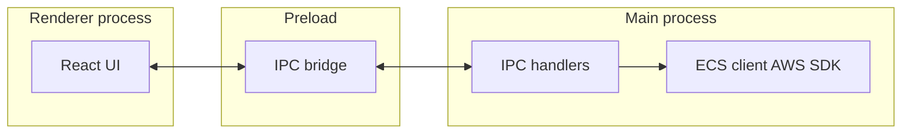

# ecenvs

[](https://github.com/tomcerdeira/ecenvs/actions/workflows/ci.yml?query=branch%3Amaster)
[](./LICENSE)
[](https://github.com/tomcerdeira/ecenvs/releases/latest)

Desktop app for browsing **AWS ECS** services and editing plain **task definition environment variables** for a selected container—then registering the task definition and updating the service when you deploy.

## Demo

Add a short screen recording (GIF) or screenshots under [`docs/readme/`](./docs/readme/) and link them here, for example:

```markdown

```

## Features

- **Connection** — Pick AWS profile and region; browse clusters and services.
- **Environment editor** — View and edit plain key/value env vars for the chosen container.
- **Diff** — Compare changes before saving.
- **Deploy** — Register task definition and update the ECS service from the app.
- **Deployments** — Inspect recent service deployment history where supported.
- **Recents** — Quick access to recently used connections.
- **Themes** — Light and dark UI.
- **Import / export** — Bring env sets in and out of the app as needed for your workflow.

## Download

Installers and archives are published on **[GitHub Releases](https://github.com/tomcerdeira/ecenvs/releases/latest)** (per platform).

To build from source, see [Development](#development) and [Packaging](#packaging).

## Prerequisites

- **Node.js** 18+ (LTS 20+ recommended)
- **npm**
- **AWS credentials** configured (for example `~/.aws/credentials` and config files consumed by the AWS SDK default chain)

## IAM permissions

The app calls ECS APIs on your behalf. Minimum permissions typically include:

| Action                     | Purpose                                      |
| -------------------------- | -------------------------------------------- |
| `ecs:ListClusters`         | List clusters in the account/region          |
| `ecs:ListServices`         | List services in a cluster                   |
| `ecs:DescribeServices`     | Service details and deployment info          |
| `ecs:DescribeTaskDefinition` | Read env and container for editing        |
| `ecs:RegisterTaskDefinition` | Save updated task definition            |
| `ecs:UpdateService`        | Point the service at the new task definition |

Tighten or extend IAM to match your organization’s policies.

## Architecture

AWS access runs in the **Electron main process** (see `src/main/services/ecs-client.ts`). The **preload** script exposes a narrow IPC API to the **React renderer**; the renderer does not import the AWS SDK directly.



## Security

- **Credentials stay on your machine** — The app uses your local AWS configuration; nothing is sent to a custom backend.
- **No hosted service** — There is no ecenvs server; traffic goes from your desktop to AWS APIs only.

## Development

```bash
npm ci
npm start
```

Other useful commands:

```bash
npm run lint
npm run typecheck
npm test
npm run package
npm run make
```

## Packaging

Local installers are produced with `npm run make`. Artifacts land under `out/make/` (for example `zip` and `dmg` on macOS).

- **Icons**: Source files live in [`assets/icons/`](./assets/icons/) (`icon.png`, `icon.icns`, `icon.ico`). Replace the placeholder artwork with your branding; large binaries can be tracked with [Git LFS](https://git-lfs.com/) if you prefer not to bloat the repo.
- **Publishing to GitHub**: `npm run publish` uploads build artifacts to GitHub Releases. In CI, set `GITHUB_TOKEN` with permission to create releases and upload assets. **Do not commit tokens**; use repository secrets only.
- **macOS distribution**: Builds downloaded onto another Mac should be signed with a **Developer ID Application** certificate and notarized with Apple. In CI that means configuring both signing certificate secrets (for example `CSC_LINK` / `CSC_KEY_PASSWORD`) and one notarization strategy. Local unsigned `dmg` files are acceptable for self-testing, but Gatekeeper can label downloaded unsigned apps as damaged and refuse to open them.
- **Auto-update**: The app uses [`update-electron-app`](https://github.com/electron/update-electron-app) in a packaged build, which checks [Electron’s update service](https://update.electronjs.org) for releases published from this repository. **macOS** auto-updates in production expect a **Developer ID** signed app, **hardened runtime**, and **notarization**; unsigned `.dmg` installs do not get a reliable auto-update experience.
- **Linux**: Electron’s built-in auto-updater does not support Linux; distribute `.deb`/`.rpm` through your own channels.

## Troubleshooting

- **AWS errors / access denied** — Confirm your profile, region, and IAM policy include the actions in [IAM permissions](#iam-permissions).
- **Build failures** — Run `npm ci` from a clean tree; ensure Node matches the [Prerequisites](#prerequisites).
- **`"<app>" is damaged and can't be opened` on macOS** — The downloaded build was not signed and notarized for Gatekeeper. Publish from CI with Apple signing secrets configured, or for a trusted local test build remove quarantine manually after copying the app out of the `dmg`.

## Contributing

See [CONTRIBUTING.md](./CONTRIBUTING.md) for branch conventions, Conventional Commits, and the PR checklist.

## Tech

- Electron Forge
- Vite
- TypeScript
- React

## License

MIT. See [LICENSE](./LICENSE).
